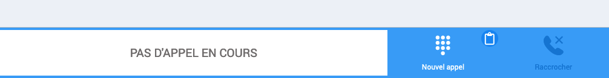
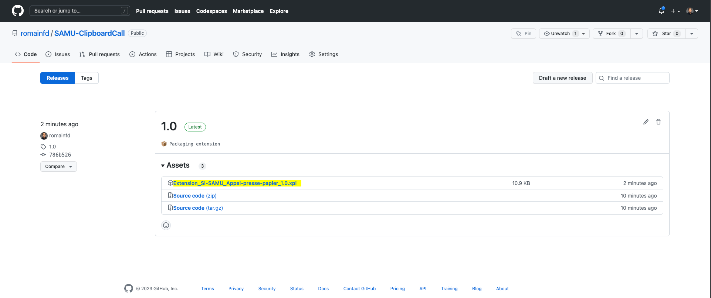

# ClipboardCall

Let's you call a phone number from your clipboard simply by clicking a button on the Bandeau Si-SAMU.

## Guide utilisateur 🇫🇷

Cette extension vous permet d'appeler un numéro copié dans le presse-papier en cliquant directement sur un bouton du bandeau SI-SAMU. 

### Illustration


### Installation
- Rendez-vous sur la page des [_releases_](https://github.com/romainfd/SAMU-ClipboardCall/releases)
- Téléchargez l'extension (fichier `.xpi`) de la _release_ la plus récente en cliquant sur le fichier (surligné en jaune dans l'image ci-dessous)
  
- Suivez le [tutoriel](https://extensionworkshop.com/documentation/publish/distribute-sideloading/#install-addon-from-file) expliquant comment installer l'extension depuis un fichier
- Rendez-vous dans le bandeau SI-SAMU, il ne vous reste qu'à copier un numéro puis cliquer pour appeler !

## Development
### Building
```
web-ext build -i sign.sh --overwrite-dest
```
